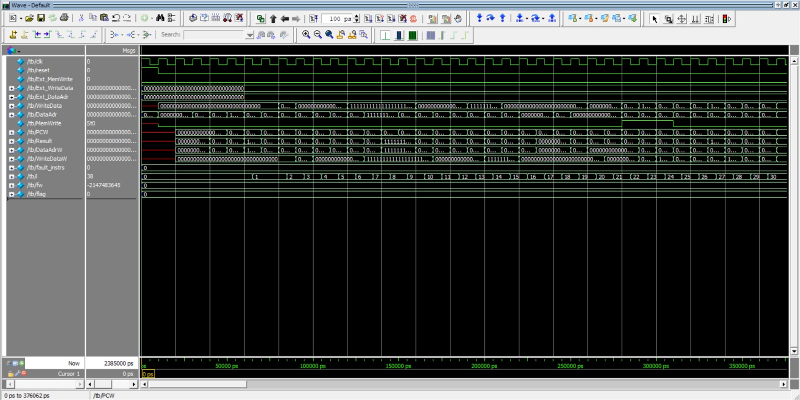
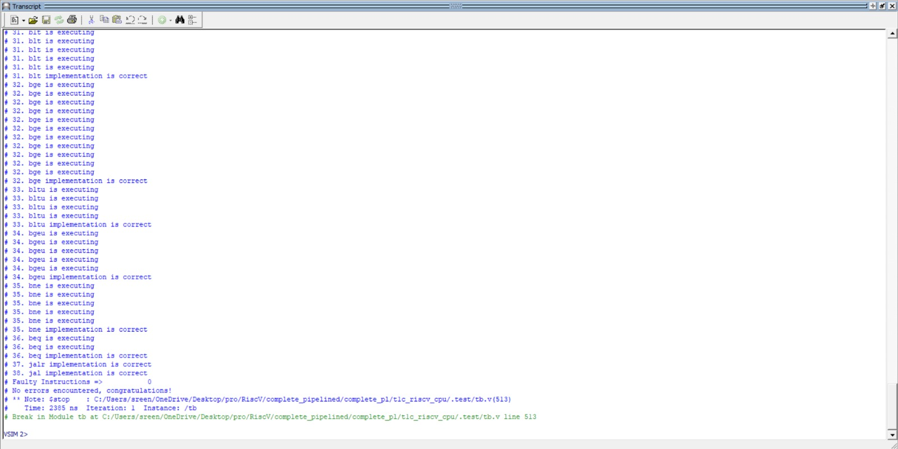
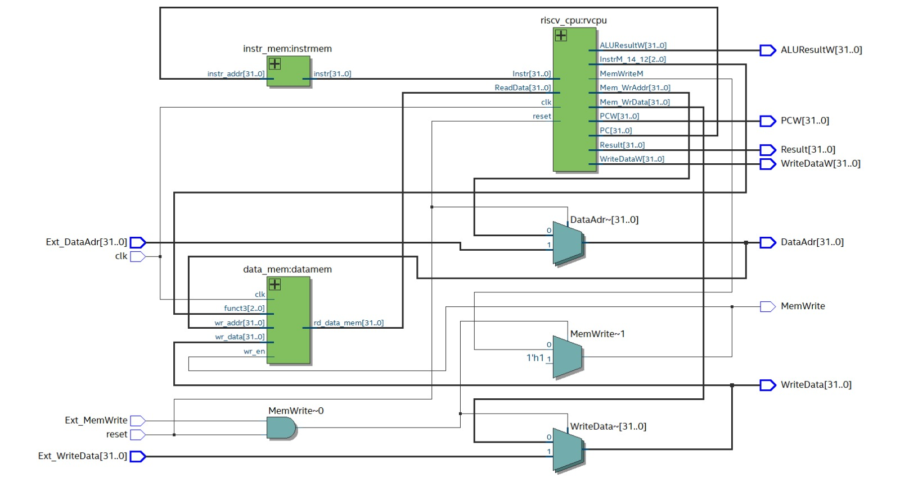
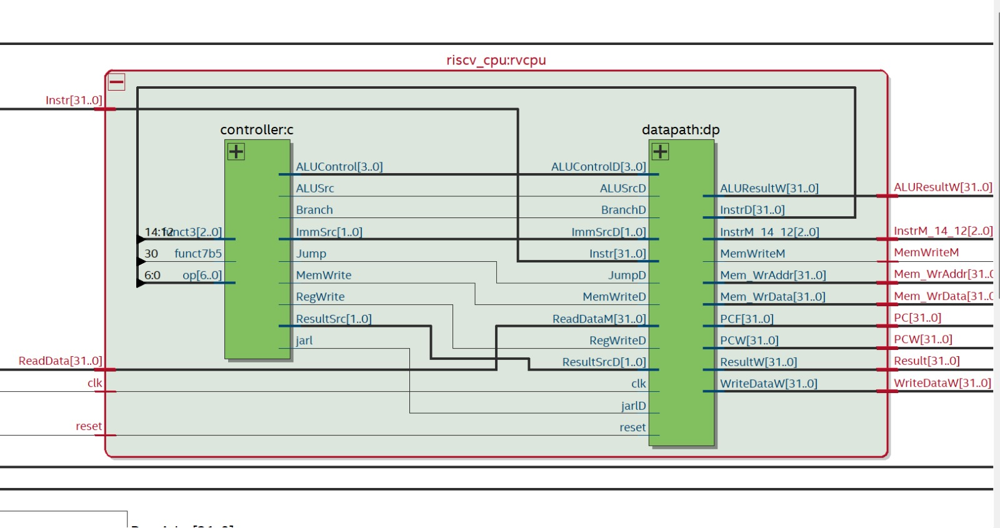
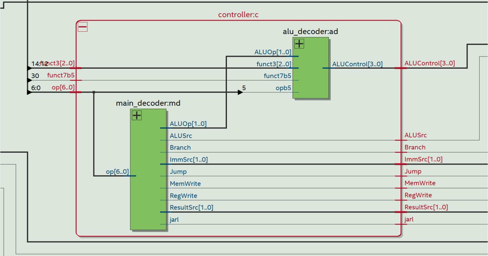
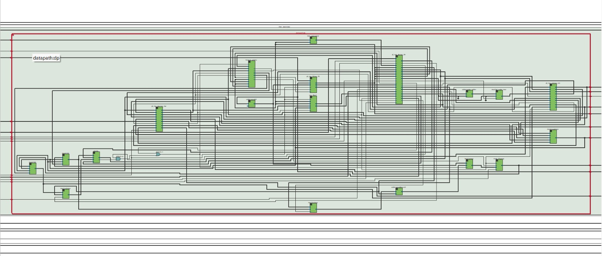
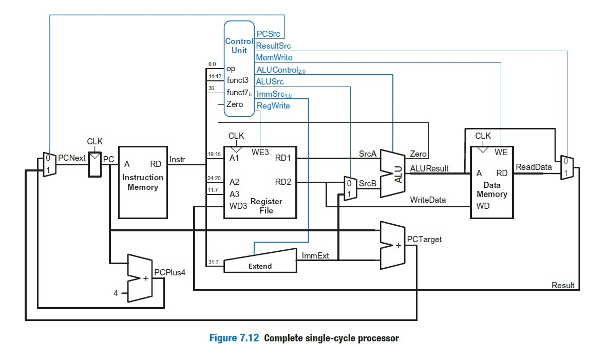

# RISC-V Pipelined CPU

This repository showcases the design of a **32-bit RISC-V processor using a 5-stage pipeline architecture**. The processor follows the RISC-V ISA and divides instruction execution into multiple stages to improve throughput. It supports all standard instruction formats: **R, I, S, B, U, and J types**, and has been verified using simulation-based testing.

---

## Tools Used

- Intel Quartus Prime  
- ModelSim (Simulation)  

## Highlights

### Pipeline Organization

The processor uses a classic 5-stage pipeline:

1. **IF (Instruction Fetch):** Retrieves the instruction from memory.
2. **ID (Instruction Decode):** Interprets the instruction and reads register operands.
3. **EX (Execute):** Performs ALU operations or computes effective addresses.
4. **MEM (Memory Access):** Handles load/store operations.
5. **WB (Write Back):** Writes results back to the register file.

---

### Hazard Management

To maintain correct execution in a pipelined environment, the design incorporates:

- **Data Hazard Handling:**  
  Managed using pipeline registers that enable forwarding and introduce stalls when required.

- **Control Hazard Handling:**  
  Addressed through branch prediction and flushing mechanisms.

> Note: A dedicated forwarding unit is not used; instead, forwarding behavior is achieved through careful pipeline register design.

---

### Instruction Support

The processor implements the following RISC-V instruction categories:

| **Type** | **Supported Instructions** |
|----------|---------------------------|
| **R-Type** | add, sub, sll, slt, sltu, xor, srl, sra, or, and |
| **I-Type** | addi, slti, sltiu, xori, ori, andi, lb, lh, lw, lbu, lhu |
| **S-Type** | sb, sh, sw |
| **B-Type** | beq, bne, blt, bge, bltu, bgeu |
| **U-Type** | lui, auipc |
| **J-Type** | jal, jalr |

All listed instructions are implemented and tested for correctness.

---

## Top-Level Interface

The processor exposes the following input/output signals:

| **Signal**        | **Direction** | **Description** |
|------------------|--------------|-----------------|
| clk              | Input        | System clock |
| reset            | Input        | Resets processor state |
| Ext_MemWrite     | Input        | External memory write enable |
| Ext_WriteData    | Input        | External data input for memory |
| Ext_DataAdr      | Input        | External memory address |
| MemWrite         | Output       | Internal memory write signal |
| WriteData        | Output       | Data sent to memory |
| DataAdr          | Output       | Address for memory operations |
| ReadData         | Output       | Data retrieved from memory |
| PC               | Output       | Current program counter value |
| Result           | Output       | ALU computation result |

---

## Architectural Description

The processor is structured around a pipelined datapath with the following core components:

- **Pipeline Registers:** Enable stage separation and assist in hazard handling  
- **Program Counter (PC):** Maintains instruction sequencing  
- **Instruction Memory:** Stores program instructions  
- **Register File:** Contains 32 general-purpose registers  
- **ALU:** Executes arithmetic and logical operations  
- **Control Unit:** Generates control signals from decoded instructions  
- **Hazard Detection Logic:** Identifies and resolves pipeline conflicts  

---

## Results and Verification

### Functional Testing

A detailed testbench was used to validate correct execution across all instruction types and pipeline stages. The simulation confirms proper pipelined execution.

- **Waveform Output:**  
  

- **Simulation Log:**  
  

---

### Netlist Visualization

The synthesized design can be inspected using Quartus Netlist Viewer:

- **Top-Level View:**  
  

- **Complete CPU Structure:**  
  

- **Inside controller:**
  
  
- **Inside datapath:**
    

---

## References

- **Reference architecture**
  

- The design approach and concepts are inspired by:

   **Digital Design and Computer Architecture: RISC-V Edition**  
     by Sarah L. Harris and David Harris
